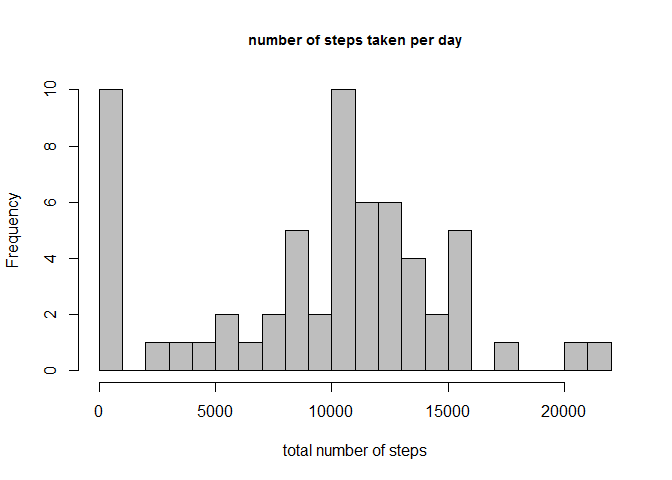
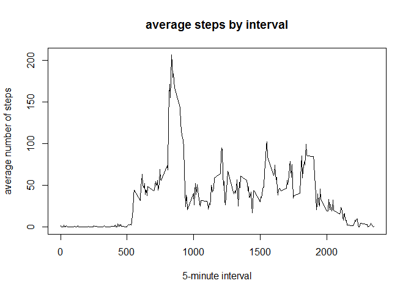
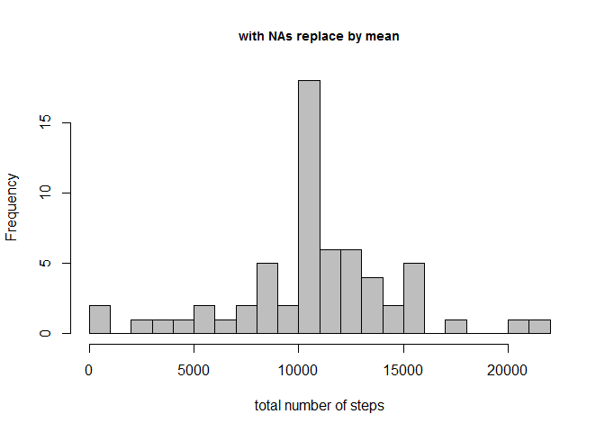
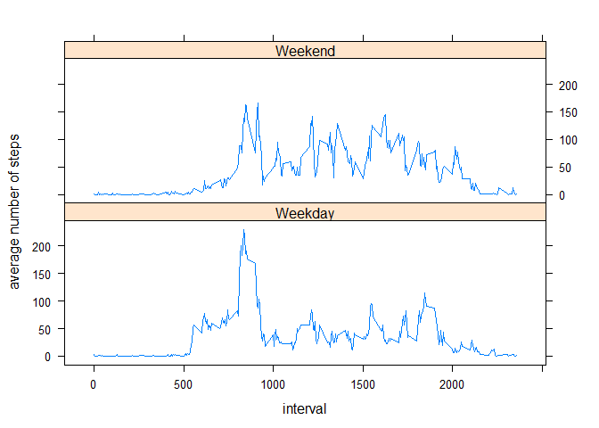

# Reproducible Research: Peer Assessment 1


## Loading and preprocessing the data


```r
#set the working path with setwd()
#read the data file
df = read.csv('activity.csv', header = TRUE)

#show the data structure
names(df)
```

```
## [1] "steps"    "date"     "interval"
```

```r
str(df)
```

```
## 'data.frame':	17568 obs. of  3 variables:
##  $ steps   : int  NA NA NA NA NA NA NA NA NA NA ...
##  $ date    : Factor w/ 61 levels "2012-10-01","2012-10-02",..: 1 1 1 1 1 1 1 1 1 1 ...
##  $ interval: int  0 5 10 15 20 25 30 35 40 45 ...
```

```r
head(df)
```

```
##   steps       date interval
## 1    NA 2012-10-01        0
## 2    NA 2012-10-01        5
## 3    NA 2012-10-01       10
## 4    NA 2012-10-01       15
## 5    NA 2012-10-01       20
## 6    NA 2012-10-01       25
```

## What is mean total number of steps taken per day?

```r
#create a table with total number of steps taken per day
dt = data.table(df)
dt_date = dt[, list(total_steps = sum(steps, na.rm = TRUE)), by = date]

plot_hist = function(x, title){
    hist(x, 
         breaks = 20,
         main = title,
         xlab = 'total number of steps', 
         col = 'grey',
         cex.main = .9)    
}

plot_hist(dt_date$total_steps, 'number of steps taken per day')
```

 

```
## [1] "The above histogram shows the total number of steps taken per day"
```

```
## [1] "The mean of the total number of steps taken per day is  9354.2"
```

```
## [1] "The median of the total number of steps taken per day is  10395"
```

## What is the average daily activity pattern?

```r
#create a table with average number of steps by interval
dt_interval = dt[, list(avg_steps = mean(steps, na.rm = TRUE)), 
                               by = interval]
#plot by 5 minute-time interval
with(dt_interval, {
    plot(interval, avg_steps, type = 'l',
         main = 'average steps by interval',
         xlab = '5-minute interval',
         ylab = 'average number of steps')
})
```

 

```r
#cal maximum number of steps for a 5-minute interval
max_steps = dt_interval[which.max(avg_steps), ]
```


```
## [1] "The 835th time interval contains the maximum number of 206.2 steps"
```

## Imputing missing values

```r
#number of NAs
sum(is.na(df$steps))
```

```
## [1] 2304
```

```r
#sort and join the tables
setkey(dt, interval)
setkey(dt_interval, interval)
dt_new = dt[dt_interval]

#replace NAs with the mean
replace_fn = function(x,y){
    if(is.na(x)){
        
        return(y)
    }
    return(x)
}
dt_new$new_steps = mapply(replace_fn, dt_new$steps, dt_new$avg_steps)

#create new table with total number of steps by date 
dt_date_new = dt_new[, list(new_steps = sum(new_steps, na.rm = TRUE)), 
                                    by = date]
#show the new table
head(dt_date_new)
```

```
##          date new_steps
## 1: 2012-10-01  10766.19
## 2: 2012-10-02    126.00
## 3: 2012-10-03  11352.00
## 4: 2012-10-04  12116.00
## 5: 2012-10-05  13294.00
## 6: 2012-10-06  15420.00
```

```r
plot_hist(dt_date_new$new_steps, 'with NAs replace by mean')
```

 


```
## [1] "The above histogram shows the total number of steps taken per day with NAs replaced with the mean"
```

```
## [1] "The new mean of the total number of steps taken per day is  10766.2"
```

```
## [1] "The new median of the total number of steps taken per day is  10766.2"
```

```
## [1] "the resulting mean and median are higher compared to the first part of the assignment when the NAs are replaced with the mean"
```


## Are there differences in activity patterns between weekdays and weekends?

```r
#function to determine day type
day_type = function(x){
    if(x %in% c('Saturday', 'Sunday')){
        return('Weekend')
    }
    return('Weekday')
}

#add day name
dt_new$dayname = weekdays(as.Date(dt_new$date))
#add day type as a factor variable
dt_new$daytype = as.factor(apply(as.matrix(dt_new$dayname), 1, day_type))

#create new table with average number of steps by interval, daytype
dt_date_new = dt_new[, list(avg_steps = mean(new_steps, na.rm = TRUE)), 
                                    by = list(interval, daytype)]

#show new table
str(dt_date_new)
```

```
## Classes 'data.table' and 'data.frame':	576 obs. of  3 variables:
##  $ interval : int  0 0 5 5 10 10 15 15 20 20 ...
##  $ daytype  : Factor w/ 2 levels "Weekday","Weekend": 1 2 1 2 1 2 1 2 1 2 ...
##  $ avg_steps: num  2.2512 0.2146 0.4453 0.0425 0.1732 ...
##  - attr(*, ".internal.selfref")=<externalptr>
```

```r
#plotting a panel plot with the average number of steps against interval
xyplot(avg_steps~interval | daytype, data = dt_date_new,
       type = 'l',
       xlab = 'interval',
       ylab = 'average number of steps',
       layout = c(1,2))
```

 


```
## [1] "the above panel plot shows the 5-minute interval(x-axis) against the average number of steps taken averaged across weekday days or weekend days(y-axis)"
```
